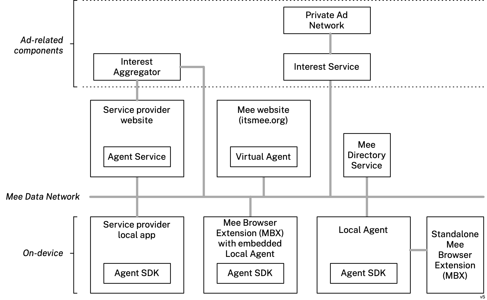

The following advertising-related terms build on the common core terms defined in [Terminology](https://docs.mee.foundation/users/basics/terminology/). 

## Interest Aggregator

A service used by one or more [service providers](https://docs.mee.foundation/users/basics/terminology/#service-provider) on the [Mee Data Network](https://docs.mee.foundation/users/basics/terminology/#mee-data-network). The [interest aggregator](#interest-aggregator) combines raw user attribute data collected by these [service providers](https://docs.mee.foundation/users/basics/terminology/#service-provider), anonymizes it, and uses it to infer a [interests](#interests) that are transmitted to and stored in the [interest service](#interest-service). An [interest aggregator](#interest-aggregator) doesn't persist user data although in performance-critical scenarios it cache temporary.

## Interest Service

A service that stores [interests](#interests). These [interests](#interests) are never shared/sold with any other entity. The [interest service's](#interest-service) database of interests can be queried by advertisers to return the number of matching (non-identified) profiles within a defined [target audience profile](#target-audience-profile). The  [interests](#interests) stored in this service sourced from [interest aggregators](#interest-aggregator) and from [interests](#interests) inferred by the user's [Mee Extension](#mee-extension).

## Interests

A dataset describing the interests and demographics of a Mee user described using the IAB SDA taxonomy. 

## Mee Extension

A browser extension with the following functionality:

- Automatically opts the user out of their data being shared/sold by websites
- Based on the user's browsing history, the extension generates a set of interests that are saved to a Mee [interest service](#interest-service)
- Mee uses these [interests](#interest) to assign the user anonymously to a group(s) of people with similar interests, but never shares them with any other company
- Mee-authorized ad networks tailor the ads the user sees based on the group(s) they are in

## Target Audience

A cohort of Mee users to which an advertiser would like to advertise.

