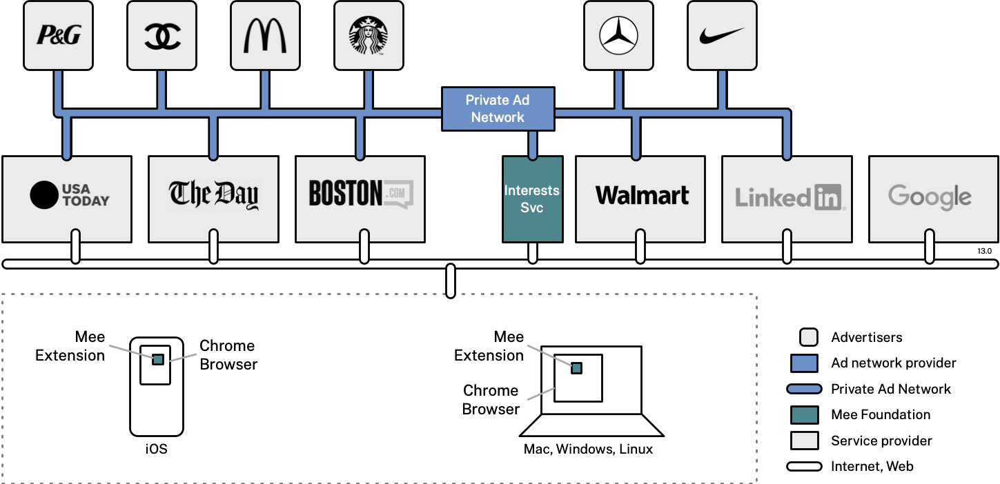

### The Mee Experience

We’re a nonprofit whose mission is to develop Mee–a human-centered user experience for the internet. It offers more control, privacy and convenience. In the Mee experience:

- You don’t have to fill in forms–passwords, names and more
- Your data is never shared or sold by anyone
- Your legal right to control your own data is enforced
- Your activities remain private–no more tracking or spying on you

### Private Advertising Project

This project applies the Mee experience to internet advertising. It includes a front-end component, the *Mee Extension,* as well as back-end services including an *Interests Service* and a *Private Ad Network*. The company logos in the following diagram below are purely hypothetical/aspirational:

### Mee Extension

This extension working in conjunction with a Mee-compatible advertising network implements private advertising. 

It opts the user out of cookie-based tracking that is commonly used to infer the user's set of interests. It replaces this tracking with an algorithm running within the extension that infers the user's set of interests based on their locally stored browsing history. It uploads this anonymous set of interests to a server that assigns the user to a group of other anonymous people with similar interests. A Mee-compatible ad network can use these interest groups to tailor ads to the user's interests.

With the Mee extension, your online activities are free from surveillance by third-party cookies and trackers. 

- Websites won’t be able to stalk you or sell your data
- No more annoying cookie banner pop-ups
- Enjoy web content supported by ads that respect your privacy and match your interests

How it works:

- The Mee extension automatically opts you out of your data being shared/sold by websites
- Based on your browsing history, which never leaves your computer, the extension generates a set of anonymous interests that are saved to a Mee server
- This Mee server uses these interests to assign you anonymously to groups of people with similar interests, but it never shares them with any other company
- Mee-authorized ad networks tailor the ads you see based on the groups you’re in

The Mee Extension is under active development. We will be submitting our initial version to Google Chrome Web Store shortly.

